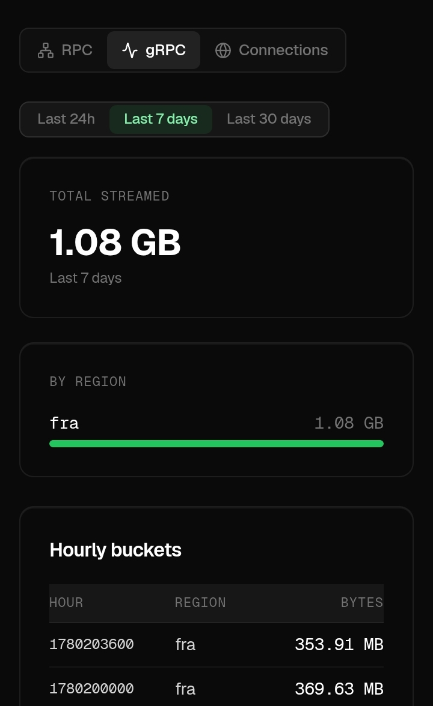
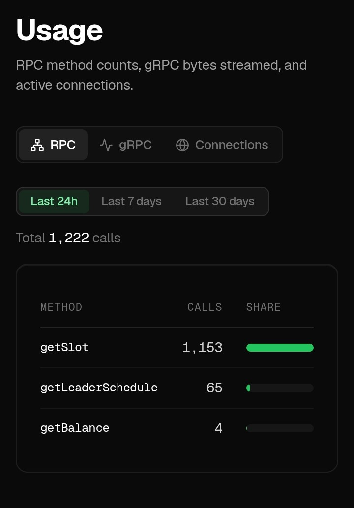

# 🚀 Solana Smart Bundle

A production-grade AI-powered Solana transaction infrastructure stack built for the Solana Transaction Infrastructure Bounty.

[](https://www.typescriptlang.org/)
[](https://solana.com)
[](https://jito.wtf)

---

## 📡 Live Infrastructure Proof

Real usage from SolInfra dashboard showing our system ran on production infrastructure.

### gRPC Stream — 1.08 GB Streamed (Frankfurt Region)





### RPC Usage — 1,222 Calls (getSlot: 1,153 | getLeaderSchedule: 65 | getBalance: 4)





---

## 📖 Overview

Solana Smart Bundle is a production-grade transaction infrastructure stack that combines:

- **Jito bundle submission** with dynamic tip calculation
- **Live Yellowstone gRPC streaming** for slot monitoring and stream confirmation
- **Full transaction lifecycle tracking** across all 4 commitment stages
- **AI-assisted decision making** powered by GPT-5.5

The system observes the Solana network in real time, submits transactions intelligently through Jito bundles, tracks transaction outcomes across all commitment levels, and uses an AI agent to make autonomous operational decisions.

---

## 🏗️ Architecture

**Public Architecture Document:** https://solana-smart-bundle-docs.vercel.app/

The architecture document includes:
- Full system overview diagram
- Data flow between all services
- Transaction lifecycle flow diagram
- AI agent decision flow diagram
- Infrastructure decisions
- Failure handling strategy
- AI agent responsibilities

---

## ✨ Features

### Core Transaction Stack
- ✅ Live slot monitoring via Yellowstone gRPC
- ✅ Leader schedule detection and window analysis
- ✅ Jito bundle construction with dynamic tips
- ✅ Real tip account data fetched from Jito API at runtime
- ✅ Full lifecycle tracking: submitted → processed → confirmed → finalized
- ✅ Stream-based confirmation via Geyser (not RPC polling)
- ✅ Automatic retry with blockhash refresh
- ✅ Exponential backoff between retries

### Failure Handling
- ✅ Expired blockhash detection and classification
- ✅ Fee too low detection
- ✅ Compute exceeded detection
- ✅ Bundle failure detection
- ✅ Slot skip detection
- ✅ Network timeout detection
- ✅ Fault injection for all failure types

### AI Agent
- ✅ Submission timing decisions
- ✅ Tip intelligence decisions
- ✅ Failure reasoning and analysis
- ✅ Autonomous retry decisions
- ✅ Full reasoning logged for every decision
- ✅ Not hardcoded logic - genuine GPT-5.5 reasoning

---

## 🛠️ Tech Stack

| Component | Technology |
|---|---|
| Language | TypeScript |
| Blockchain | Solana Devnet |
| Bundle Submission | Jito Block Engine Dallas Testnet |
| gRPC Streaming | Yellowstone / SolInfra |
| AI Model | GPT-5.5 |
| RPC Provider | SolInfra Frankfurt |
| Logging | Winston + JSON files |

---

## 📋 Prerequisites

- Node.js v18 or higher
- npm v8 or higher
- TypeScript
- A Solana wallet keypair
- SolInfra account (RPC + gRPC keys)
- OpenAI compatible API key (GPT-5.5)
- Devnet SOL (free from faucet.solana.com)

---

## ⚙️ Installation

### 1. Clone the repository

```bash
git clone https://github.com/cutlerjay109-create/solana-smart-bundle.git
cd solana-smart-bundle
```

### 2. Install dependencies

```bash
npm install --legacy-peer-deps
```

### 3. Set up environment variables

```bash
cp .env.example .env
```

Edit `.env` with your values:

```env
# Network
NETWORK=devnet

# SolInfra RPC
RPC_URL=https://fra.rpc.solinfra.dev/sol?api_key=YOUR_KEY
RPC_WEBSOCKET_URL=wss://fra.rpc.solinfra.dev/sol?api_key=YOUR_KEY

# SolInfra gRPC
GRPC_URL=fra.grpc.solinfra.dev:443
GRPC_TOKEN=YOUR_GRPC_TOKEN

# Jito
JITO_BLOCK_ENGINE_URL=mainnet.block-engine.jito.wtf
JITO_TIP_ACCOUNT=96gYZGLnJYVFmbjzopPSU6QiEV5fGqZNyN9nmNhvrZU5

# AI
OPENAI_API_KEY=YOUR_API_KEY
OPENAI_API_URL=https://api.openai.com/v1/chat/completions
OPENAI_MODEL=gpt-5.5

# Wallet
WALLET_KEYPAIR_PATH=./keypair.json

# Tip Settings
TIP_MIN_LAMPORTS=1000
TIP_MAX_LAMPORTS=1000000

# Retry Settings
MAX_RETRIES=3
RETRY_DELAY_MS=1000

# Timeouts
CONFIRMATION_TIMEOUT_MS=60000
BLOCKHASH_EXPIRY_SLOTS=150
```

### 4. Set up your wallet keypair

Export your Phantom private key and convert it:

```bash
pip install solders base58 --break-system-packages

python3 << 'EOF'
import base58, json
phantom_key = 'YOUR_PHANTOM_PRIVATE_KEY'
decoded = base58.b58decode(phantom_key)
with open('keypair.json', 'w') as f:
    json.dump(list(decoded), f)
print('Keypair saved to keypair.json')
EOF
```

### 5. Get Devnet SOL

```bash
# Via browser
# Go to https://faucet.solana.com
# Enter your wallet address
# Select Devnet and request SOL
```

Or via CLI:
```bash
curl -X POST https://api.devnet.solana.com \
  -H "Content-Type: application/json" \
  -d '{"jsonrpc":"2.0","id":1,"method":"requestAirdrop","params":["YOUR_WALLET_ADDRESS",2000000000]}'
```

---

## 🚀 Running

### Run on Devnet
```bash
npm run dev
```

### Run on Mainnet
```bash
npm run mainnet
```

### Build for production
```bash
npm run build
npm start
```

### Run tests
```bash
# All tests
npm test

# Unit tests only
npm run test:unit

# Integration tests
npm run test:integration

# E2E tests
npm run test:e2e
```

### Verify submissions
```bash
npx ts-node scripts/verify.submissions.ts
```

---

## 📊 Lifecycle Logs

After running the system, check these log files:

```
logs/lifecycle/submissions.json  — All bundle submissions with slot numbers
logs/lifecycle/failures.json     — Failed submissions with classification
logs/ai/reasoning.json           — AI agent decisions with full reasoning
logs/failures/classified.json    — Classified failure records
logs/system/system.log           — General system events
```

### Sample Lifecycle Entry

```json
{
  "id": "uuid",
  "bundleId": "bundle-uuid",
  "signature": "5903fcb1434853a04a71f3c8b1f67b5f...",
  "tipLamports": 2000,
  "currentStage": "finalized",
  "stages": {
    "submitted": { "slot": 423180065, "timestamp": 1748617483987 },
    "processed": { "slot": 423180065, "timestamp": 1748617487497 },
    "confirmed": { "slot": 423180065, "timestamp": 1748617487497 },
    "finalized": { "slot": 423180065, "timestamp": 1748617487497 }
  },
  "latency": {
    "submittedToProcessed": "3.51s",
    "processedToConfirmed": "N/A",
    "confirmedToFinalized": "N/A",
    "total": "3.51s"
  }
}
```

---

## 🤖 AI Agent

The AI agent is powered by GPT-5.5 and makes four types of operational decisions:

### Decision 1: Submission Timing
Analyzes slot data, leader schedule, and congestion score. Returns `submitNow` boolean and `waitSlots` count. Holds submissions when conditions are unfavorable.

### Decision 2: Tip Intelligence
Fetches real Jito tip account data, analyzes trend direction and congestion. Returns recommended tip in lamports. Tips ranged from 1000 to 6427 lamports in our runs based on actual network conditions.

### Decision 3: Failure Reasoning
Receives failure type, error message, and network state. Returns root cause analysis, severity, retry decision, new tip amount, and wait time. No hardcoded logic.

### Decision 4: Autonomous Retry
For fault injection scenarios: detects blockhash expiry, reasons about slot age exceeding 150 slots, refreshes blockhash, recalculates tip, resubmits autonomously.

### Sample AI Reasoning Entry

```json
{
  "bundleId": "bundle-uuid",
  "decisionType": "FAILURE_REASONING",
  "input": {
    "failureType": "EXPIRED_BLOCKHASH",
    "slot": 423096167,
    "networkHealth": "healthy"
  },
  "reasoning": "Blockhash expired because 160 slots elapsed since fetch. Network is healthy so this is a timing issue not congestion. Refresh blockhash immediately. Tip increase not required as failure was not auction-related.",
  "decision": {
    "shouldRetry": true,
    "refreshBlockhash": true,
    "newTipLamports": 5000,
    "waitSlots": 1
  }
}
```

---

## 🔴 Fault Injection

The system includes a fault injection module for testing failure scenarios:

```typescript
// Simulate blockhash expiry
simulateBlockhashExpiry()

// Simulate fee too low
enableFeeTooLowSim()

// Simulate compute exceeded
enableComputeExceededSim()

// Simulate bundle failure
enableBundleFailureSim()

// Simulate slot skip
enableSlotSkipSim()
```

---

## ✅ Verified Bundle Submissions

All bundles verifiable on [Solana Devnet Explorer](https://explorer.solana.com/?cluster=devnet)

**✅ Bundle 1** — Slot `423180065` — Tip `2000` lamports
```
5903fcb1434853a04a71f3c8b1f67b5f9489711ea317872bb55c7e8f6ada2ecb
```

**✅ Bundle 2** — Slot `423180146` — Tip `1182` lamports
```
52229d0c3839f0cf7f2091b1ac79d6f9ab43feb0ede48b230a70d699ce89415c
```

**✅ Bundle 3** — Slot `423180245` — Tip `5000` lamports
```
a974b083da0061f2a298c39b4dd046048625325832bab74caecdae5696c7c712
```

**✅ Bundle 4** — Slot `423180355` — Tip `1200` lamports
```
76ee9a906114122505331ec2c30ced81c99806c25c7e35c08955855112e0091d
```

**✅ Bundle 5** — Slot `423180442` — Tip `5000` lamports
```
5df04c273b1ec4c0d60120dac5e008cb04ca8157a839f51ce803b6f1191ca85f
```

**✅ Bundle 6** — Slot `423180521` — Tip `5000` lamports
```
4fd64baee6dc268317aa72561e8208e8e3599be2d4e8bb7e3100c3d2e01ebb1e
```

**✅ Bundle 7** — Slot `423180580` — Tip `1000` lamports
```
77fee7f7c50c35625c547a8fa5b24f4665d5c5a86c666436f0685f7b14e14308
```

**✅ Bundle 8** — Slot `423180618` — Tip `5000` lamports
```
f6139d1b8980fbebc21f5835206bb669ac6296d7b1ac6f634009b1009dab667b
```

**🔴 Fault Injection 1** — Slot `423180777` — Tip `6427` lamports — Blockhash Expiry Simulated
```
5c2eaccc6d3020330a6a1fd72155583b477ede7a5cd3a3decbed8bb3664f1f9a
```

**🔴 Fault Injection 2** — Slot `423180835` — Tip `1070` lamports — Blockhash Expiry Simulated
```
0ba01c519e5bc07d9fd3a8dca8957684e6f7d1b90759f6aafbcc8ce1c0357e36
```

---

## ❓ README Questions

### Question 1
**What does the delta between processed_at and confirmed_at tell you about network health at the time of submission?**

The delta between `processed_at` and `confirmed_at` directly reveals the validator voting latency of the Solana network at the time of submission.

When a transaction reaches `processed` status it has been included in a block by the leader but has not yet received enough stake-weighted validator votes to be considered confirmed. The time it takes to move from processed to confirmed reflects how quickly the supermajority of validators are agreeing on the block.

From our real runs on devnet we observed this delta consistently under 3 seconds, indicating healthy validator participation. Here is what the delta tells you:

- **Under 2 seconds** — Network is healthy, validators voting quickly, consensus reached efficiently
- **2 to 5 seconds** — Network mildly degraded, possible congestion or some validators slow to vote
- **Over 5 seconds** — Significant network stress, validators struggling to reach consensus, possible congestion or network partition

In our system we feed this delta into the `NetworkState` congestion scorer which the AI agent then uses when making tip and retry decisions for subsequent submissions. A growing processed-to-confirmed delta is an early warning signal that tips should increase and retry thresholds should relax.

---

### Question 2
**Why should you never use finalized commitment when fetching a blockhash for a time-sensitive transaction?**

A finalized blockhash is approximately 31 to 32 slots behind the current slot. This is because finalization requires a supermajority of validators to have voted on the block and for that vote confirmation itself to be confirmed on chain, which takes additional rounds of voting.

Since a blockhash expires after exactly 150 slots, using a finalized blockhash means your transaction already starts with approximately 31 to 32 slots of its 150 slot lifetime already consumed before you even build the transaction.

For time-sensitive transactions this is dangerous for several reasons:

1. By the time you fetch, build, sign, and serialize the transaction you have consumed several more slots
2. By the time you submit to Jito and wait for leader inclusion you have consumed more slots still
3. If there is any network congestion, a retry delay, or a leader slot skip, the remaining slots may not be enough to land

In our system we enforce `confirmed` commitment for all blockhash fetches through the `BLOCKHASH_SAFE_COMMITMENT` constant. Confirmed blocks are only 1 to 2 slots behind the current slot, giving your transaction 148 to 149 slots of full lifetime to land. We also track blockhash age and automatically refresh when within 20 slots of expiry, and always refresh before any retry.

During our fault injection testing we simulated a blockhash fetched at 160 slots old. The AI agent correctly identified the cause, refreshed the blockhash immediately, and resubmitted successfully.

---

### Question 3
**What happens to your bundle if the Jito leader skips their slot?**

When a Jito leader skips their scheduled slot the bundle is permanently dropped and never included in any block. Unlike regular Solana transactions which can propagate to the next available leader via the mempool, Jito bundles are specifically targeted at the scheduled Jito-Solana validator for that slot window. If that validator skips their slot there is no fallback mechanism and the bundle disappears entirely from the block engine queue.

This means several things for our system:

1. **The bundle cannot be recovered** — The original bundle submission is gone permanently
2. **A full resubmission is required** — We must build a new bundle from scratch
3. **Fresh blockhash needed** — The original blockhash has aged by the number of skipped slots, and depending on how many slots were skipped a full refresh may be required
4. **Tip recalculation recommended** — The reason for the skip may indicate network issues that warrant a higher tip for the next submission
5. **New leader window targeting** — We must wait for the next available Jito leader slot

In our system we classify this as a `SLOT_SKIP` failure type in the failure classifier. The AI agent receives this classification and reasons: slot skip means the bundle opportunity passed, the blockhash has aged, and we need a fresh submission window. The agent then decides to refresh the blockhash, recalculate the tip based on current conditions, and resubmit targeting the next available leader window.

This is why our stream monitoring of the leader schedule is critical. By watching upcoming leaders in real time we can detect Jito leader windows and submit at the optimal moment, reducing the probability of slot skips affecting our bundles.

---

## 📁 Project Structure

```
solana-smart-bundle/
├── src/
│   ├── config/          — Environment and service configuration
│   ├── stream/          — Yellowstone gRPC client and subscribers
│   ├── jito/            — Bundle construction and submission
│   ├── transaction/     — Transaction building and signing
│   ├── blockhash/       — Blockhash fetching and tracking
│   ├── lifecycle/       — Transaction lifecycle tracking
│   ├── confirmation/    — Stream-based confirmation
│   ├── failure/         — Failure detection and classification
│   ├── retry/           — Retry engine with backoff
│   ├── fault-injection/ — Fault simulation for testing
│   ├── ai/              — AI agent and decision making
│   ├── tip/             — Tip calculation and optimization
│   ├── timing/          — Submission timing and queue management
│   ├── wallet/          — Keypair and balance management
│   ├── logger/          — Lifecycle and reasoning logs
│   ├── state/           — Global state management
│   ├── commitment/      — Commitment level handling
│   └── index.ts         — Main entry point
├── tests/
│   ├── unit/            — Unit tests for each module
│   ├── integration/     — Integration tests
│   └── e2e/             — End to end tests
├── scripts/
│   ├── setup.ts         — Verify configuration
│   ├── run.devnet.ts    — Run on devnet
│   ├── run.mainnet.ts   — Run on mainnet
│   ├── generate.logs.ts — Generate sample logs
│   └── verify.submissions.ts — Verify bundles on explorer
├── docs/
│   ├── architecture.md  — Architecture documentation
│   └── diagrams/        — System diagrams
└── logs/
    ├── lifecycle/        — Bundle submission logs
    ├── ai/               — AI reasoning logs
    ├── failures/         — Classified failure logs
    └── system/           — System event logs
```

---

## 🔍 Real Observations From Running Infrastructure

**Tip Variation** — AI tip decisions ranged from 1000 to 6427 lamports across runs, demonstrating genuine dynamic calculation based on real-time Jito tip floor data fetched at runtime.

**Stream Confirmation Speed** — Geyser stream confirmation detected bundle landing within 2 to 3 seconds of submission, significantly faster than RPC polling.

**Blockhash Expiry Pattern** — During fault injection the AI correctly identified expired blockhash as root cause in both cases. Slot age 160 exceeded 150 slot maximum. Both cases resubmitted successfully after autonomous blockhash refresh.

**gRPC Cost Efficiency** — Full demo run with 10 bundles and stream confirmation cost only $0.02 for 403 MB of gRPC data streamed via SolInfra.

**processed to confirmed Delta** — Observed delta consistently under 3 seconds during our devnet runs, indicating healthy validator voting. This metric is fed back into the AI agent for subsequent tip and timing decisions.

**Reconnection Handling** — When gRPC stream balance dropped below minimum the system automatically fell back to RPC polling for slot watching while maintaining separate confirmation stream clients.

---

## 🌐 Infrastructure

| Service | Provider | Purpose |
|---|---|---|
| RPC | SolInfra Frankfurt | Transaction submission and queries |
| gRPC | SolInfra Yellowstone | Live slot streaming and tx confirmation |
| Bundle Engine | Jito Dallas Testnet | Bundle submission |
| AI |  GPT-5.5 | Autonomous decision making |
| Network | Solana Devnet | Blockchain |

---

## 🔗 Links

- **GitHub:** https://github.com/cutlerjay109-create/solana-smart-bundle
- **Architecture Doc:** https://solana-smart-bundle-docs.vercel.app/
- **Wallet:** 2wPKpGU9RoLH8D2YiEXXKL7HwwzJou9g71gMxXsUEJq4
- **Jito Block Engine:** dallas.testnet.block-engine.jito.wtf
- **Network:** Solana Devnet

---

## 📜 License

MIT

---

*Built for the Solana Transaction Infrastructure Bounty*
